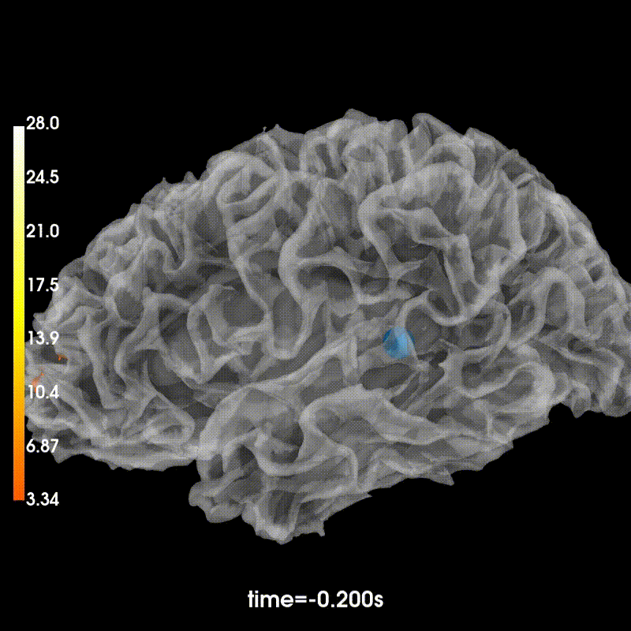
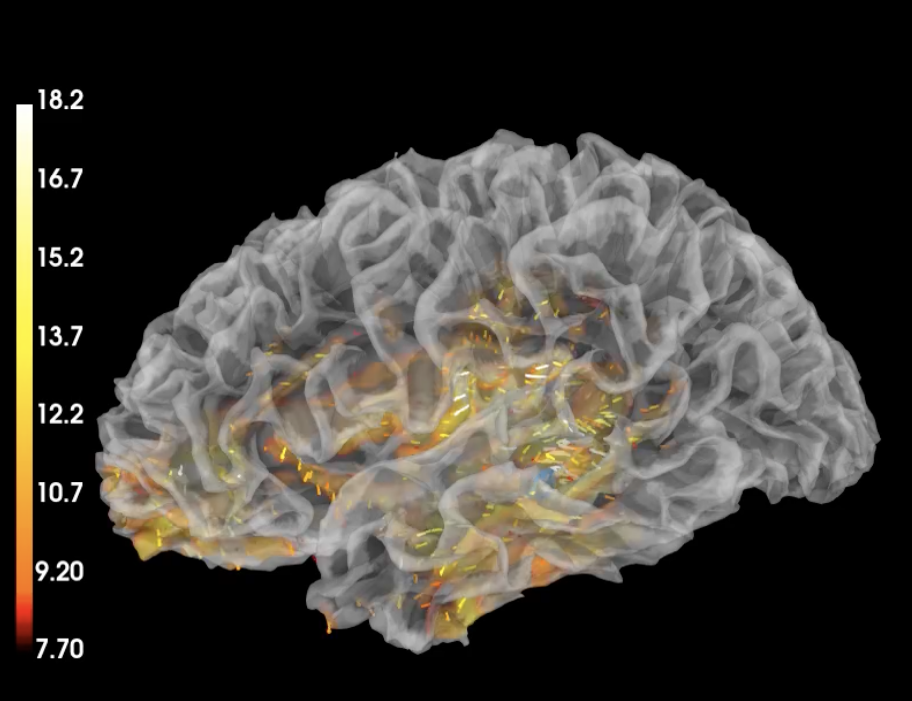

# DhW: Decoding the hidden Waves

<p  align="center"  width="100%">
    
     
    
</p>

> **Decoding the hidden Waves: Revealing the Nature of Brain Activity**
> [Riccardo Tedoldi](https://www.instagram.com/riccardotedoldi/)
> 
> Supervisor: [Uri Hasson](https://webapps.unitn.it/du/it/Persona/PER0048943/Pubblicazioni)
>
> *Artificial and Biological Neural Systems, Spring 2023* 


This repository contains the code for the seminar paper "Decoding the hidden Waves: Revealing the Nature of Brain Activity" (DhW).

## Introduction

In this study, I investigated the representation of M/EEG in a feature space. The mapping learned by the networks. It has been shown to cluster the neural activity of correlated event types. Correlation between neural activity and people's thoughts/event type. It would enable modern BCIs to assist people with disabilities.

### Installation

I report here the file to create a conda environment with all the requirements.

``` bash
conda create --name <env-name> --file ./requirements.txt
```

Then, you can activate the environment with:

``` bash
conda activate <env-name>
```

#### Datasets

I release the data used in the experiments in a [gDrive](https://drive.google.com/drive/folders/1IRZZGuC8f9lrTxA5k1fG8uOUA58Tkkym?usp=sharing) folder. The data that you can find there have been preprocessed and are ready to be used.

``` python
import torch

PATH_1 = <path>+'/X.pt'
PATH_2 = <path>+'/y_label_face.pt'
PATH_3 = <path>+'/x_face_embedding.pt'

# to load the data
x = torch.load(PATH_1)
y = torch.load(PATH_2).to(torch.float32)
emb_y = torch.load(PATH_3).to(torch.float32)

y.shape, x.shape, emb_y.shape

```

#### Usage
Here the structure of the repository:

```
├── experiments
│   ├── 0_<name_notebook>
│   ├── 1_<name_notebook>
│   ├── ...
│   ├── n_<name_notebook>
├── src
│   ├── architecture1
│   |   ├── model.py
|   |   ├── _all_the_modules.py
|   |   ├── _utils.py
│   |   ├── train.py # exemplificative
│   ├── architecture2
│   |   ├── model.py
|   |   ├── _all_the_modules.py
|   |   ├── _utils.py
│   |   ├── train.py # exemplificative
```

The notebook in the folder `experiments` are numbered and have a name. Then in the folder you can find a README.md file with a short description for each notebook.
### Contributing
If you want to contribute to this project, I am happy to hear from you. 


Please contact me: 
- [@riccardotedoldi](https://www.instagram.com/riccardotedoldi/) 

#### Acknowledgements

I thanks Uri Hasson for the supervision and the support during the project. Also, I thanks Christian Brodbeck to help me to fix an issue with the data preprocessing.


### To cite this work

``` bibtex
@misc{tedoldi2023decoding,
      title={Decoding the hidden Waves: Revealing the Nature of Brain Activity}, 
      author={Riccardo Tedoldi},
      year={2023},
      url  = {https://github.com/r1cc4r2o/DhW}
}
```